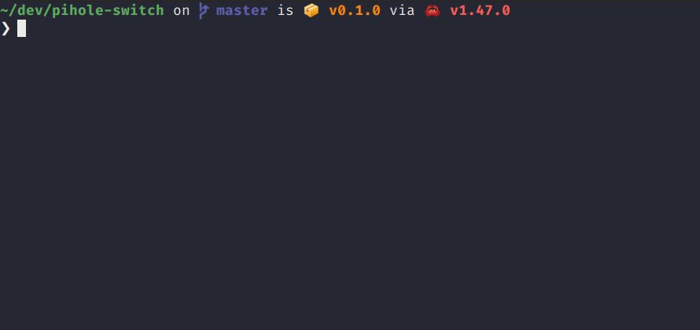

# Pihole Switch


A command line tool to enable/disable your [pihole](https://pi-hole.net/)



## Installation

From source:
```bash
git clone https://github.com/devmatteini/pihole-switch && cd pihole-switch
cargo build --release
./target/release/phs
```

## Usage
Export an environment variable `PIHOLE_TOKEN=<pihole_api_token>`.

You can find the api token here: http://pi.hole/admin/settings.php?tab=api, then under the section `Query log`, click on the button `Show API token` and confirm.

---

Enable pihole
```bash
$ phs enable
```

Disable pihole
```bash
$ phs disable
```

Disable pihole for 20 seconds
```bash
$ phs disable --time 20
```

If your device doesn't have pihole set as dns
```bash
$ phs --host 192.168.1.50 disable
```
where `192.168.1.50` is the pihole device ip address.

Enable/disable by passing the api token as an argument, instead of using the `PIHOLE_TOKEN` environment variable
```bash
$ phs enable <api_token>
```
_**Note: the `PIHOLE_TOKEN` environment variable will always have priority even if you pass the api token as an argument**_

## License
`pihole-switch` is made available under the terms of the MIT License.

See the [MIT License](LICENSE) file for license details.